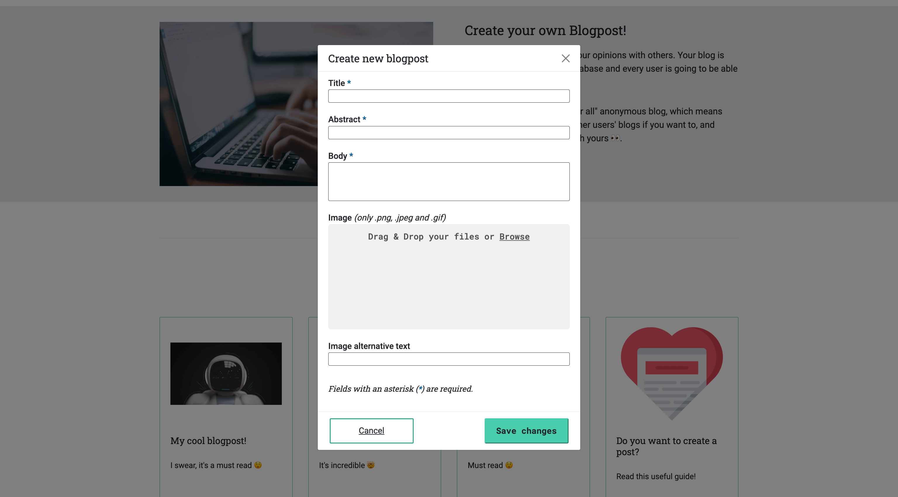

# MI Blog
This is a project made just for fun and practice.

MI Blog is a website in which you can create your own blogposts. It follows an anonymous "free for all" format, which means that you can delete or edit other user's posts, and they could to the same with yours! 

It features:
* A CRUD system, to allow users interact with a database.
* A form with validation logic, to avoid sending incorrect data to the database. 
* A details page for each item, which allows user to select a specific blog and get more details on it.
* An accessible UI that follows the Web Content Accessibility Guidelines (WCAG) 2.1 (AAA).

To build it I used:
* NodeJS
* Express 
* MongoDB 
* JavaScript
* HTML5
* CSS3

## Screenshots

## In case you want to run this project in your local environment:
To build it, I used Node v16.15.1 and npm v8.11.0. 

1. npm install 
2. npm run devStart 

I don't claim ownership for any of the images used on it (beside the ones that include myself in them).
