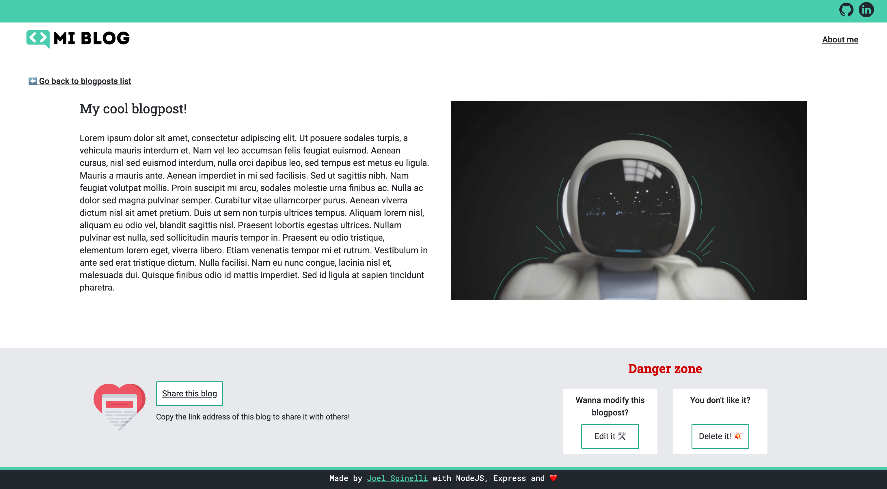

# MI Blog
This is a project made just for fun and practice.

MI Blog is a website in which you can create your own blogposts. It follows an anonymous "free for all" format, which means that you can delete or edit other user's posts, and they could to the same with yours! 

## MI Blog features: 
* A CRUD system, to allow users interact with a database.
* A form with validation logic, to avoid sending incorrect data to the database. 
* A details page for each item, which allows user to select a specific blog and get more details on it.
* An accessible UI that follows the Web Content Accessibility Guidelines (WCAG) 2.1 (AAA).

## Technologies I used: 
* NodeJS
* Express 
* MongoDB 
* JavaScript
* HTML5
* CSS3

## In case you want to run this project in your local environment:
You need to have both node and npm installed on your computer. I recommend installing them by using the [Node Version Manager](https://github.com/nvm-sh/nvm) (nvm), otherwise you can download them from [here](https://nodejs.org/en). 

To build this project I used Node v16.15.1 and npm v8.11.0, so it's also advisable that you use the same versions. 

Follow these steps: 
1. Open the project on your preferred code editor. 
2. Run the following command: **npm install** 
3. Create a file called **.env** and inside of it declare the following environment variables: 
    1. **DATABASE_URL**=insert_here_the_url_to_your_mongo_database
    2. **PORT**=insert_here_the_port_number_in_which_you_want_to_run_the_project
4. Run a local server using this command: **npm run devStart** 
5. Open a browser and go to http://localhost:PORT-YOU-SELECTED

## Screenshots

_I don't claim ownership for any of the images used on this project (beside the ones that include myself in them)._
